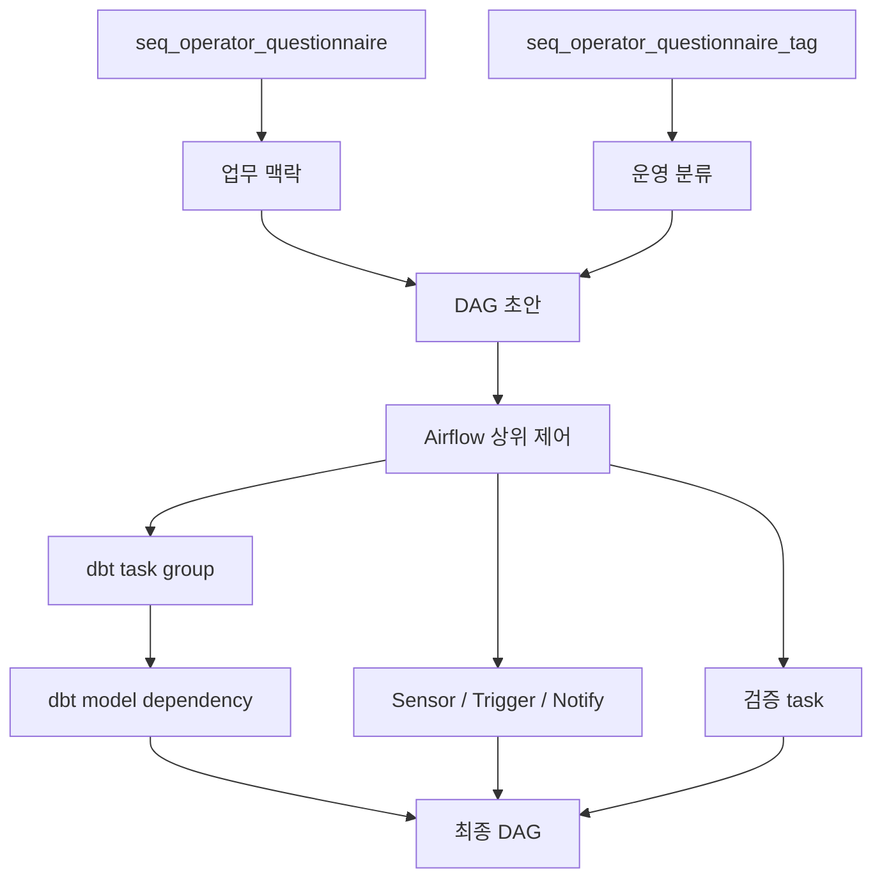
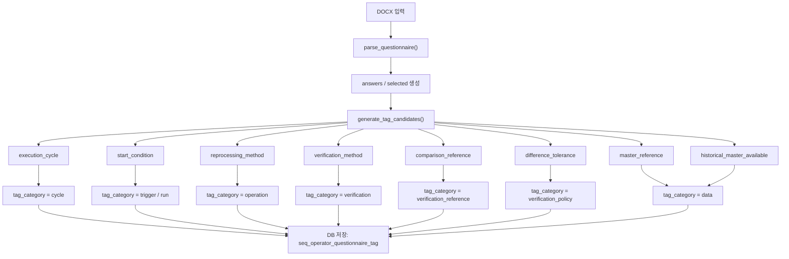
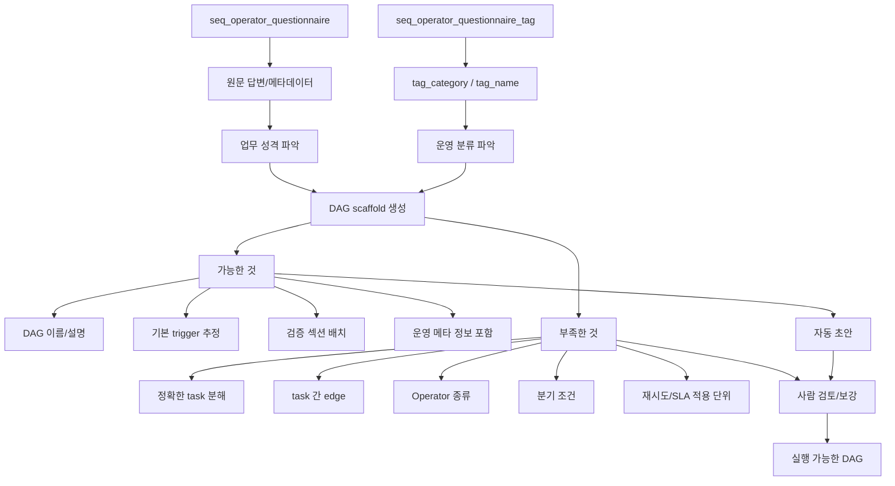
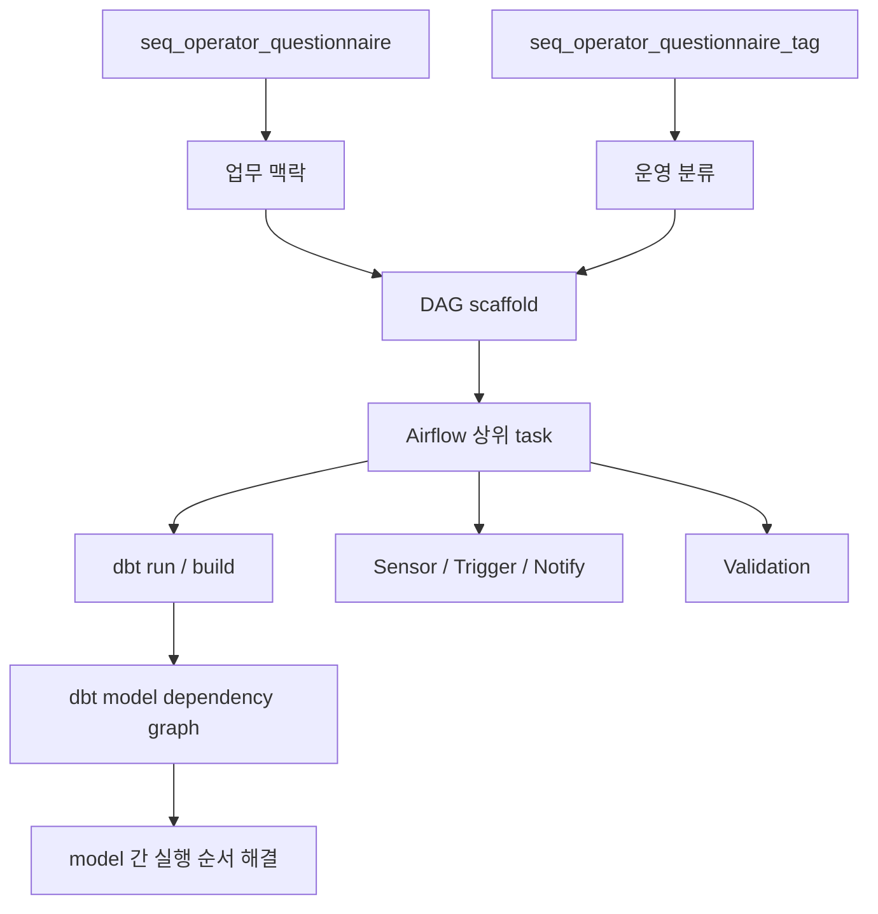
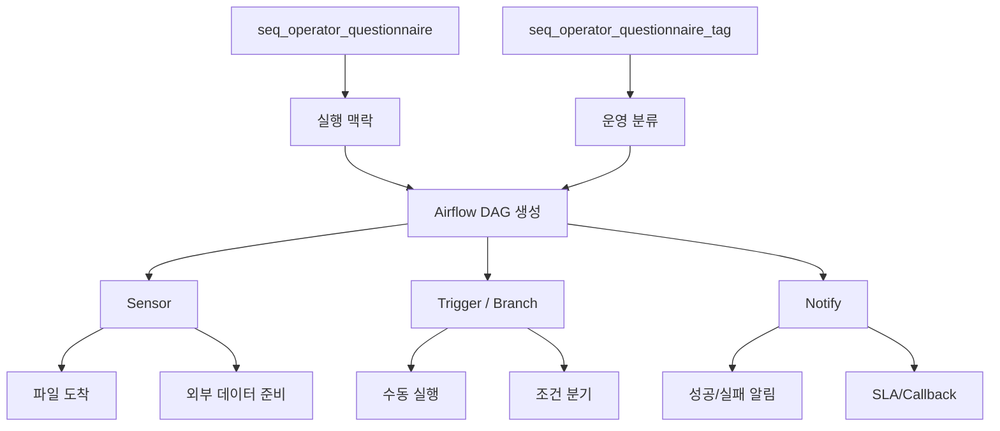

# 두 테이블을 이용한 DAG 자동 생성 방안

## 질문

`seq_operator_questionnaire`와 `seq_operator_questionnaire_tag` 두 테이블만으로 DAG를 자동 생성할 수 있는가?

## 결론

현재 정보만으로 **DAG 초안 자동 생성은 가능**하다.

다만 **실행 가능한 최종 DAG를 완전 자동으로 만들기에는 일부 정보가 부족**하다.

즉, 가장 현실적인 구조는 아래와 같다.

```text
두 테이블
  -> DAG 초안 자동 생성
  -> Airflow 기능과 dbt 의존성 반영
  -> 애매한 부분만 사람 검토
  -> 최종 DAG 확정
```

## 테이블의 역할

### `seq_operator_questionnaire`

- 질문지 1건의 원문과 구조화된 답변을 보관한다.
- `seq_name`, `business_name`, `owner` 같은 업무 맥락을 담는다.
- `execution_cycle`, `start_condition`, `main_processing_flow`, `verification_*` 같은 실행/검증 정보를 담는다.
- tag 생성의 기준 데이터가 된다.

### `seq_operator_questionnaire_tag`

- 질문지 1건에서 파생된 의미 단위 tag를 저장한다.
- `tag_category`와 `tag_name`으로 업무 성격을 분류한다.
- `source_field`, `source_value`, `rule_code`로 어떤 근거로 만들어졌는지 남긴다.

## 현재 정보로 가능한 것

| 영역 | 자동 생성 가능 범위 |
|---|---|
| DAG 이름/설명 | `seq_name` / `business_name` 기반 생성 |
| 실행 주기 추정 | `execution_cycle`, `start_condition` 기반 분류 |
| 시작 조건 분류 | `trigger_schedule`, `trigger_file`, `run_manual` 등 |
| 외부 대기 판단 | `external_dependency`, `file_data_wait` 기반 판단 |
| 재처리 성향 파악 | `reprocessing_method`, `retry_criteria` 기반 판단 |
| 실패/알림 필요성 | `job_failure_action`, `success_failure_notification` 기반 판단 |
| 검증 단계 위치 | `verification_method`, `comparison_reference`, `verification_timing` 기반 판단 |
| dbt 실행 묶음 | `main_processing_flow`와 tag 기반 묶음 구성 |
| 기본 TaskGroup 구조 | DAG scaffold 자동 생성 |

## 추가 확인이 필요한 것

| 영역 | 추가 확인 필요 |
|---|---|
| schedule rule | 정확한 `cron` 또는 `schedule_interval` |
| Sensor 종류 | `FileSensor`, `ExternalTaskSensor`, custom sensor 중 무엇인지 |
| dbt model 매핑 | 질문지 업무와 dbt model/group의 1:1 또는 1:N 대응 |
| 알림 채널/수신자 | Email, Slack, Callback 등 |
| 검증 실행 조건 | 검증을 언제 어떤 기준으로 수행할지 |
| 재시도 적용 단위 | task 단위인지 group 단위인지 |
| 분기 조건 세부 규칙 | `Branch` 판단의 구체 조건 |

## 사람 개입이 필요한 것

| 영역 | 사람 개입 필요 이유 |
|---|---|
| task 간 최종 edge 확정 | dbt graph 외부의 실행 순서를 최종 확정해야 함 |
| 모호한 운영 문구 해석 | “상황별 판단”, “모름/확인 필요” 같은 표현은 해석이 필요함 |
| 예외 케이스 판정 | 일반 규칙으로 처리하기 어려운 운영 사례가 있음 |
| 모델명 ↔ 업무 매핑 | dbt model 이름과 업무를 정확히 연결해야 함 |
| 운영 정책 승인 | retry, SLA, notify 정책은 조직 승인 필요 |

## 두 테이블 + Airflow + dbt 조합의 핵심 아이디어

task 간 연결은 가능한 한 **dbt model 의존성**에 위임한다.

```text
Airflow
  └─ 상위 제어
      ├─ Sensor / Trigger / Notify
      ├─ dbt task group 실행
      └─ 검증 task 배치

dbt
  └─ model dependency graph
      └─ task 간 상세 순서 해결
```

이 구조를 쓰면 Airflow는 다음만 책임지면 된다.

- 언제 시작할지
- 외부 입력을 기다릴지
- 실패 시 어떻게 할지
- 검증을 언제 할지
- 알림을 누구에게 보낼지

dbt는 내부 model 순서를 책임진다.

## 자동 생성 가능 / 추가 확인 필요 / 사람 개입 필요

| 분류 | 내용 |
|---|---|
| 자동 생성 가능 | DAG 이름/설명, 실행 주기 추정, 시작 조건 분류, 외부 대기 판단, 재처리 성향, 실패/알림 필요성, 검증 단계 위치, dbt 실행 묶음, 기본 TaskGroup 구조 |
| 추가 확인 필요 | 정확한 schedule rule, Sensor 종류, dbt model/group 매핑, 알림 채널/수신자, 검증 실행 조건, 재시도 적용 단위, 분기 조건 세부 규칙 |
| 사람 개입 필요 | task 간 최종 edge 확정, 모호한 운영 문구 해석, 예외 케이스 판정, 모델명 ↔ 업무 1:1 매핑, 운영 정책 승인 |

## 자동 생성 파이프라인

| 단계 | 입력 | 자동 처리 | 출력 | 비고 |
|---|---|---|---|---|
| 1. 질문지 로드 | `seq_operator_questionnaire` | 원문/메타데이터 읽기 | 업무 맥락 | 기준 데이터 |
| 2. 태그 로드 | `seq_operator_questionnaire_tag` | `tag_category`, `tag_name` 읽기 | 운영 분류 | 정책 신호 |
| 3. 업무 유형 분류 | 두 테이블 | cycle/trigger/verification/data 추정 | DAG 성격 | 거의 자동 |
| 4. DAG 스캐폴드 생성 | 분류 결과 | DAG 이름, 설명, 기본 TaskGroup 생성 | DAG 뼈대 | 자동 가능 |
| 5. dbt 그룹 매핑 | `main_processing_flow`, tag | dbt model/group 후보 배치 | dbt task 그룹 | 일부 확인 필요 |
| 6. Sensor/Trigger 배치 | `start_condition`, `external_dependency` | 파일/의존성/수동 실행 분기 | Sensor/Branch | Airflow 기능 활용 |
| 7. Notify 배치 | `job_failure_action`, `success_failure_notification` | 실패/성공 알림 훅 추가 | 알림 task | 수신자 필요 가능 |
| 8. 검증 task 배치 | `verification_*` | 검증 위치와 방식 추정 | validation task | 기준 정밀화 필요 |
| 9. edge 정리 | dbt dependency + Airflow 정책 | task 순서 연결 | 실행 그래프 | dbt가 대부분 해결 |
| 10. 최종 검토 | 생성 결과 | 애매한 부분 표시 | 승인/수정본 | 사람 개입 |

## 실무적인 규칙표

| 단계 | 입력 신호 | 규칙 | 자동 출력 | 예외/보강 |
|---|---|---|---|---|
| DAG 식별 | `seq_name`, `business_name` | `seq_name`을 DAG ID 기준으로 사용 | `dag_id`, `dag_name`, `description` | 이름 중복 시 정규화 규칙 필요 |
| 실행 주기 | `execution_cycle`, `start_condition` | `일배치/주배치/월배치/수시`로 스케줄 성격 분류 | `schedule_interval` 후보 | 정확한 cron은 확인 필요 |
| 시작 방식 | `start_condition` | `파일 도착`이면 Sensor, `수동 실행`이면 manual/branch, `정해진 시간`이면 schedule | 시작 task 유형 | Sensor 종류는 추가 확인 |
| 외부 대기 | `external_dependency`, `file_data_wait` | 외부 시스템/파일 대기가 있으면 Sensor 추가 | `FileSensor`/`ExternalTaskSensor` 후보 | 대상 경로/대상 DAG 필요 |
| dbt 묶음 | `main_processing_flow` | 처리 흐름을 dbt task group 후보로 묶음 | `dbt_run_group` | model 매핑은 보강 필요 |
| task 연결 | dbt model dependency | task 간 세부 edge는 dbt graph에 위임 | dbt 내부 순서 | dbt project manifest 필요 |
| 병렬 처리 | `parallel_execution`, `parallel_branch_detail` | `있음`이면 병렬 group 생성 | parallel TaskGroup | 분기 조건 정밀화 필요 |
| 실패 정책 | `job_failure_action`, `failure_action_detail` | `SEQ 전체 종료`면 fail fast, `운영자 확인`이면 callback/hold | retry/callback 정책 | 알림 대상 필요 |
| 재처리 정책 | `reprocessing_method`, `retry_criteria` | 전체/실패부터/구간별로 재시도 정책 분기 | retries, retry_delay | 실제 적용 단위 확인 필요 |
| 알림 | `success_failure_notification` | 성공/실패 알림 필요 여부 결정 | notify task/callback | 채널/수신자 필요 |
| 검증 | `verification_method`, `comparison_reference`, `verification_timing` | 검증 방식과 위치 결정 | validation task | 정확한 검증 기준 필요 |
| 운영 중요도 | `operational_importance` | `상`이면 높은 우선순위/엄격 정책 | priority, SLA 후보 | 조직 정책 확인 필요 |
| 검토 플래그 | `*_check_needed`, `모름/확인 필요`, `상황별 판단` | 사람이 판단해야 하는 항목으로 표시 | review flag | 자동 생성 중단 아님 |
| 최종 산출 | 전체 결과 | 자동 생성 가능한 부분만 코드화 | DAG 초안 | 불명확 항목은 TODO 표시 |

## Mermaid 한 줄 요약



## 정리

- `seq_operator_questionnaire`는 **맥락**이다.
- `seq_operator_questionnaire_tag`는 **분류**다.
- Airflow는 **실행 제어**다.
- dbt는 **task 간 순서**다.

따라서 현재 정보만으로는 **DAG 초안 자동 생성은 가능**하고,
**실행 가능한 최종 DAG는 일부 확인과 사람 검토가 필요**하다.

## 추가 결론

현재의 2개 테이블을 이용하면 **DAG 자동 생성 파이프라인 자체는 충분히 만들 수 있다**.

즉, 이 테이블들은 다음 역할을 수행한다.

- `seq_operator_questionnaire`: 업무 맥락과 실행/검증 정보를 제공한다.
- `seq_operator_questionnaire_tag`: 운영 분류와 표준화된 정책 신호를 제공한다.

이 조합이면 다음 단계가 가능하다.

```text
질문지 로드
  -> 태그/맥락 해석
  -> DAG scaffold 생성
  -> dbt dependency 반영
  -> Sensor / Notify / Validation 배치
  -> 검토 포인트만 사람 확인
```

정리하면,

- **DAG 자동 생성 파이프라인 생성은 가능**
- **완전 무인 자동 생성은 일부 보강이 필요**

## 중간 단계 제안

현재 두 테이블을 Airflow/DAG 생성기로 직접 인터페이싱하기보다는,
**사람이 판단한 정보를 담는 별도의 Excel 문서**를 중간 단계로 두는 편이 더 현실적이다.

이 방식의 이유는 다음과 같다.

- `seq_operator_questionnaire`와 `seq_operator_questionnaire_tag`에는 해석이 필요한 문구가 남아 있다.
- `상황별 판단`, `모름/확인 필요` 같은 값은 자동 규칙만으로 결정하기 어렵다.
- dbt model 매핑, Sensor 종류, 알림 대상 같은 항목은 사람이 최종 확정해야 한다.

Excel은 다음 역할을 한다.

- 사람이 해석한 최종 판단을 기록한다.
- DAG 생성기 입력을 표준화한다.
- 모호한 문구를 실행 가능한 규칙으로 바꾼다.

권장 흐름은 아래와 같다.

```text
두 테이블
  -> 자동 해석 초안 생성
  -> 사람 판단 Excel 반영
  -> DAG 생성기 입력 확정
  -> Airflow / dbt 자동 생성
```

즉, 실무적으로는 다음 구조가 적절하다.

- **원본 근거**: `seq_operator_questionnaire`
- **자동 분류**: `seq_operator_questionnaire_tag`
- **최종 판단층**: 별도 Excel
- **실행 산출물**: DAG 코드

## 논의 메모

이 방향은 현실적이다.

두 테이블은 아래까지는 잘 제공한다.

- 원본 맥락
- 자동 분류
- 후보 태그

하지만 다음 항목은 사람이 최종 판단해야 한다.

- `dbt model/group` 매핑
- Sensor 종류
- 알림 대상
- 예외 처리 기준
- 모호한 운영 문구 해석

그래서 중간에 Excel을 "결정 계약면"으로 두는 편이 좋다.

이 구조를 쓰면 다음이 가능하다.

- 자동화 가능한 부분은 자동화한다.
- 애매한 부분만 사람이 확정한다.
- 그 확정값을 기준으로 파이프라인을 만든다.

다음으로 보면 좋은 항목은 아래와 같다.

- Excel에 어떤 컬럼이 있어야 하는지
- 어떤 값은 자동 채움, 어떤 값은 수동 입력인지
- 최종적으로 DAG generator가 어떤 입력 포맷을 받는지

## Excel 설계안

| 컬럼 | 설명 | 입력 주체 | 값 예시 | 자동 채움 여부 |
|---|---|---|---|---|
| `seq_name` | DAG 기준 식별자 | 자동 | `SEQ_PRODUCT_MASTER` | 자동 |
| `business_name` | 업무명 | 자동 | `상품 기준정보 갱신` | 자동 |
| `dag_id` | 최종 DAG ID | 자동/조정 | `seq_product_master` | 자동+보정 |
| `dag_name` | 표시 이름 | 자동 | `SEQ_PRODUCT_MASTER - 상품 기준정보 갱신` | 자동 |
| `schedule_type` | 스케줄 유형 | 자동+사람 | `daily`, `manual`, `event` | 자동 초안 |
| `schedule_interval` | cron 또는 preset | 사람 | `0 1 * * *` | 수동 |
| `start_mode` | 시작 방식 | 자동+사람 | `file_sensor`, `manual`, `time_based` | 자동 초안 |
| `sensor_type` | 사용할 Sensor | 사람 | `FileSensor` | 수동 |
| `sensor_target` | 대기 대상 | 사람 | `/inbound/*.dat` | 수동 |
| `dbt_group` | dbt 그룹명 | 자동+사람 | `product_master` | 자동 초안 |
| `dbt_selector` | dbt selector | 자동+사람 | `tag:product_master` | 자동 초안 |
| `model_mapping` | 업무-모델 매핑 | 사람 | `stg_product -> int_product -> fct_product` | 수동 |
| `validation_mode` | 검증 방식 | 자동+사람 | `count`, `sample`, `dbt_test` | 자동 초안 |
| `validation_timing` | 검증 시점 | 사람 | `after_dbt` | 수동 |
| `notify_on_success` | 성공 알림 | 사람 | `Y` | 수동 |
| `notify_on_failure` | 실패 알림 | 사람 | `Y` | 수동 |
| `notify_channel` | 알림 채널 | 사람 | `Slack` | 수동 |
| `notify_recipients` | 수신자 | 사람 | `data-ops` | 수동 |
| `retry_policy` | 재시도 정책 | 자동+사람 | `3 times / 5 min` | 자동 초안 |
| `failure_policy` | 실패 시 처리 | 자동+사람 | `stop`, `continue`, `manual_review` | 자동 초안 |
| `exception_rule` | 예외 실행 규칙 | 사람 | `월말만 추가 실행` | 수동 |
| `priority` | 우선순위 | 자동+사람 | `high`, `medium`, `low` | 자동 초안 |
| `review_status` | 검토 상태 | 사람 | `approved`, `needs_review` | 수동 |
| `review_comment` | 판단 근거 | 사람 | `파일 대기 필요함` | 수동 |

### 시트 구성 권장안

- `DAG_Mapping`: DAG 기본 식별, schedule, dbt 그룹, 우선순위
- `Sensor_Notify`: Sensor 타입, 대기 대상, 알림 채널, 수신자
- `Validation_Policy`: 검증 방식, 시점, 실패/재처리 정책
- `Review_Log`: 사람 판단 근거와 승인 상태

### 운영 원칙

- 자동 채움: `seq_name`, `business_name`, `tag 기반 분류`, `초안 policy`
- 수동 입력: `sensor_type`, `dbt model 매핑`, `알림 대상`, `예외 규칙`
- 사람 승인 필요: `schedule_interval`, `최종 edge`, `운영 예외`


---
# TAG 생성 과정


# DAG 생성 가능 여부 검토


# Task간의 의존성은 DBT 모델 의존성 활용


# Sensor / Trigger / Notify는 Airflow 기능을 활용하면 해결이 될것 같은데

